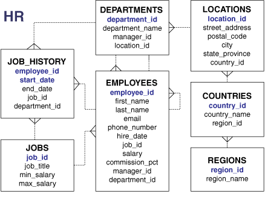
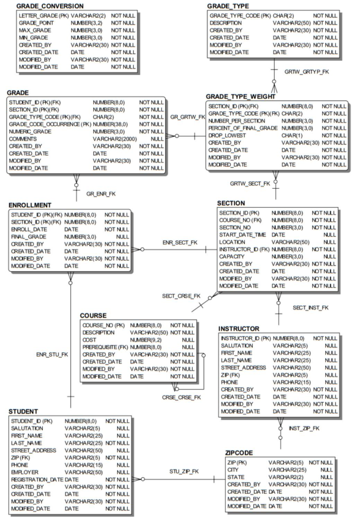

# Esquemas de Ejemplo

## HR
Modelo clásico utilizado en cursos relacionados a motores Oracle. Representa una estructura organizacional donde se gestionan entidades como empleados, departamentos, ubicaciones, roles e historial laboral.

## Academico
Representa un sistema para el manejo de una institución educativa, con entidades clave como estudiantes, instructores, cursos, secciones y matrículas.

## Sakila
Base de datos clásica que representa las entidades necesarias para la gestión de un videoclub. Posee los datos de las películas y también lo necesario para registrar los alquileres de películas.

Inicialmente elaborado para MySQL, también cuenta con versiones para otros motores. Disponible [aquí](https://github.com/jOOQ/sakila).
